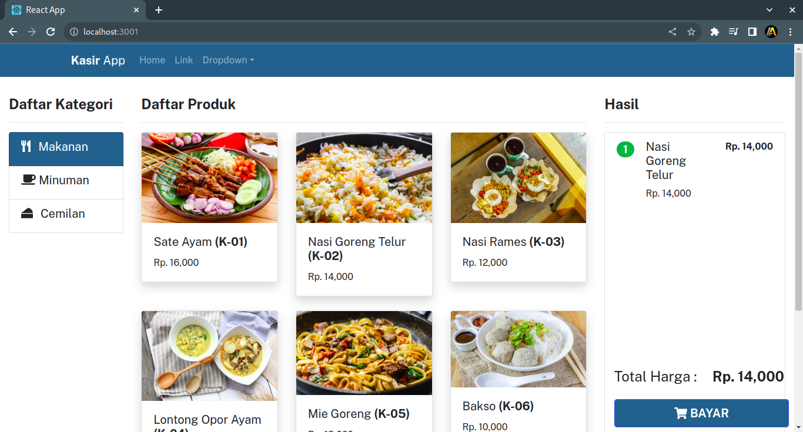

# Kasir-App--ReactJS-

## Installation

Install my-project with npm

```bash
git clone https://github.com/AkhyarAzamta/Kasir-App--ReactJS-
```
```bash
npm i -g json-server
```
Run json-server
```bash
cd backend
```
```bash
json-server --watch db.json
```
## Run App on frontend
change the API_URL in the utils>constants.js folder according to the backend port
```bash
npm run start
```

## Authors

- [@akhyar.azamta](https://www.github.com/AkhyarAzamta)